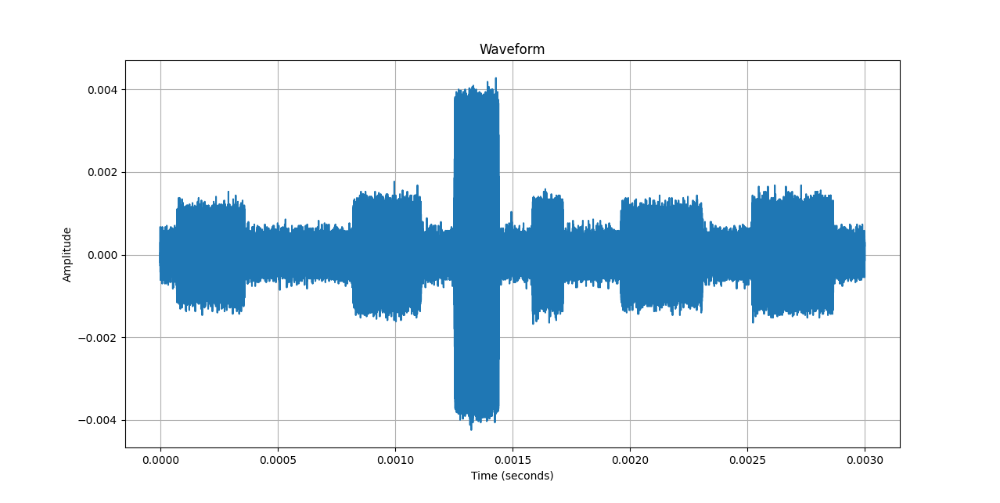

# Bluetooth Wearable Device Dataset
This repository contains metadata and usage examples of radio recordings from wearable devices, captured using SDR in an RF isolated environment. The raw data recordings can be accessed [here](https://pubfaili.edi.lv/wearsecdata) . Each recording is accompanied by its own metadata file (top.yaml), detailing its production process and parameters and JSON file which contains decoded bits and information regarding its Bluetooth parameters.

## Example usage
This repository provides two usage examples tailored to visualize the dataset. For practical demonstrations, smaller sample files are located within the _example_radio_data/ folder. These 2 useage examples will also work with the rest of the dataset.
```
pip3 install -r requirements.txt
python3 plot_data.py /path/to/top.yaml
python3 demodulated_data.py
```
The first example demonstrates the visualization of physical waveforms from the dataset. 
```console
$ python3 plot_data.py _example_radio_data/top.yaml 
Choose a file to load:
1. Channels_05 data (Channelized 5 MHz Bandwidth)
2. Channels_25 data (Channelized 25 MHz Bandwidth)
3. Output Recording (Not Channelized)
Enter the number corresponding to the file you want to load: 3
Data From _example_radio_data/./radio.data loaded.
Sample Rate: 100000000
Center Frequency: 2441500000
Recording Duration: 0.003 seconds
BD_ADDR of Wearable Device: None
Connection Timestamps:
- Enabling bluetooth on smartphone: None seconds
- Disconnected: None seconds
Enter the start time (in seconds): 0
Enter the stop time (in seconds): 0.003
```
<p align="center">

</p>

The second example showcases demodulated and decoded results extracted from the radio recordings within the dataset. It will search whole dataset for JSON files and promt user to pick one of them.

While providing valuable insights into the wireless traffic, it's important to note that we used our own methods to decode the data and the results may not fully represent all traffic present. For instance, PSK demodulation, commonly used by Bluetooth devices, is not done in our processing and thus not included in the results.

```console
$ python3 demodulated_data.py
Select a JSON file to load:
1. ./_example_radio_data/_example_recording.json
Enter the number corresponding to the file you want to load: 1
Number of all packets: 4423

Enter the packet number you want to load (or 'q' to quit): 100
Packet 100:
sample_file: Beats_Solo3_Wireless/recording_1/paired/process/radio_05_0_0.chdata
left: 9275654
right: 9276055
length: 401
signal_max: 0.0015004
signal_mean: 0.0013458756
payload_std: -1.0
index_25: 0
index_5: 0
local_freq: 1483.7905236908
demod_start: 39
bits: 01010100011101011100010110001100110001110011001101000101111001110010
packet_lt_addr: None
packet_type: ID  
packet_flow: None
packet_arqn: None
packet_seqn: None
packet_hec: None
packet_id: True
header_fec: 0.0
clock: 9275693
lap: 110011001101000101111001
comment: 
header: None
```

| Field          | Description                                          |
|----------------|------------------------------------------------------|
| Packet         | Signal number detected within radio recording        |
| sample_file    | Path to the sample file containing the recording |
| left           | Starting sample in sample_file for this signal       |
| right          | Ending sample in sample_file for this signal         |
| length         | right - left, length of signal in samples            |
| signal_max     | Maximum amplitude of detected signal                 |
| signal_mean    | Signal mean amplitude                                |
| payload_std    | Standard deviation of the signal amplitude (if only GFSK modulated is used, deviation is smaller). Calculated only if sufficient overall lenght of signal for payload EDR payload |
| index_25       | Which of the four 25 MHZ channelized recordings      |
| index_5        | Which of the five 5 MHZ channelized recordings       |
| local_freq     | Local frequency within the 5MHz sample file |
| demod_start    | Offset of perfomed GFSK demodulation start from the signal start|
| bits           | Decoded bits (if available)                          |
| packet_lt_addr | Bluetooth logical transport address (LT_ADDR)        |
| packet_type    | Header TYPE field                                    |
| packet_flow    | Header FLOW field                                    |
| packet_arqn    | Header ARQN field                                    |
| packet_seqn    | Header SEQN field                                    |
| packet_hec     | Header HEC field                                     |
| packet_id      | Is the packet ID packet?                             |
| header_fec     | Ratio of header FEC 1/3 bits, which are equal (higher number - more likely decoding is correct)|
| clock          | Starting sample in sample_file for demodulated packet (left + demod_start)|
| lap            | LAP (lower address part)                             |
| comment        | Additional comments (if any)                         |
| header         | Packet header                                        |

## Metadata structure

#### Recording Details

- **Recording Date:** Date of the recording.
- **Recording Location:** Location where the recording took place.

#### Recording Device

- Details about the recording device used for recording, tuned frequency, gain settings and output file.

#### Wearable Device

- Information about the wearable device being recorded. Device type, Bluetooth address and applications used.

#### Master Device

- Details about the master device involved in the recording. 

#### Recording Duration

- Duration of the recording in seconds.

#### Recording Timeline Description

- Timestamps of specific events during the recording process. 

#### Event Scenario

- Whether or not the Wearable device was paired to Master Device before the recording.

#### Event Desription

- Description of events that occurred during the recording.

#### File Format

- Format of the recorded data files.

#### Channelized Data

- Information about the channelized data. 

## Citing the dataset
If you are publishing academic work and you wish to cite this dataset, please cite original article:

BibTeX:
```
@article{rusins2024wearable,
  title={Wearable Device Bluetooth/BLE Physical Layer Dataset},
  author={Rusins, Artis and Tiscenko, Deniss and Dobelis, Eriks and Blumbergs, Eduards and Nesenbergs, Krisjanis and Paikens, Peteris},
  journal={Data},
  volume={9},
  number={4},
  pages={53},
  year={2024},
  publisher={MDPI}
}
```
